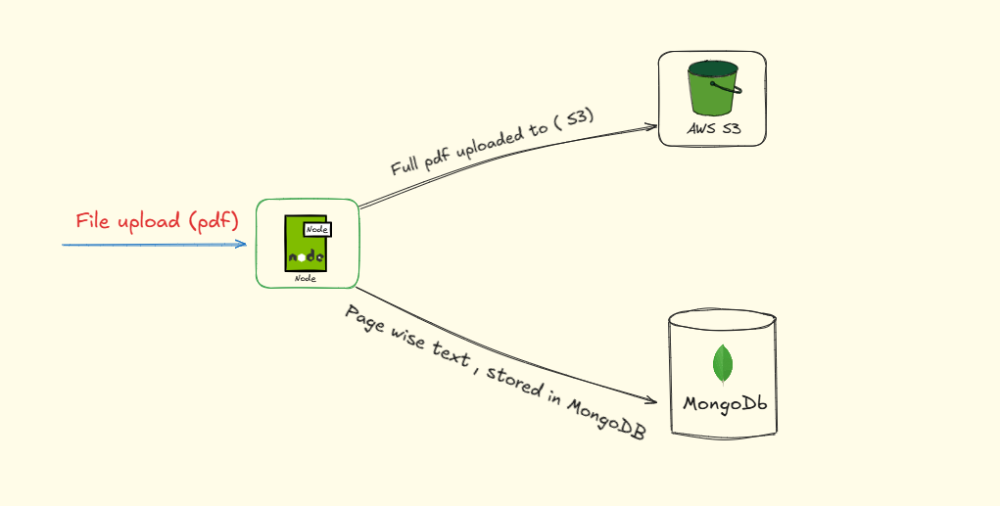
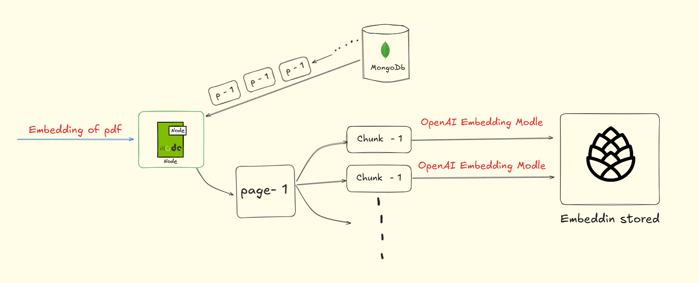
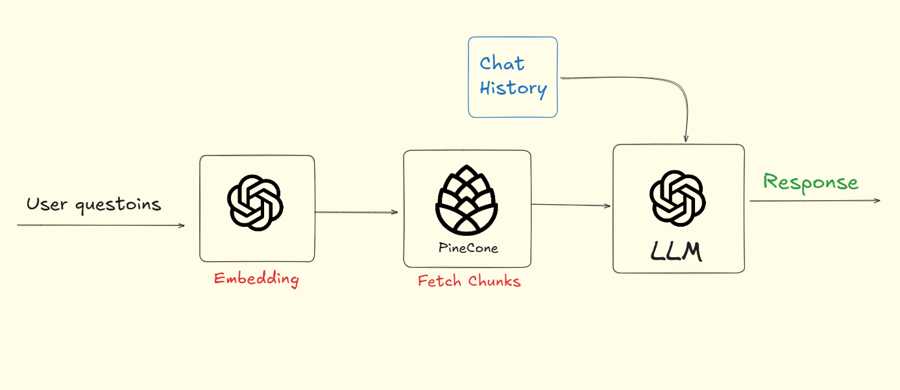

#  BeyondChat - Interactive Quiz App with Chat & YouTube Video Suggestions

#  *Key Features*

1. **🧠 AI-Driven Explanations with Page References** – Get detailed explanations for quiz questions, where the AI provides context-aware answers along with **page references** from your uploaded PDFs for better understanding.  

2. **📚 RAG based Chat with Your PDFs (Page-Referenced)** – Upload your study materials or notes as PDFs and interact with them directly. The AI responds with **page-referenced insights**, showing exactly where the relevant information exists in your documents.  

3. **🎥 YouTube Video Recommendations** – Receive **personalized and topic-based YouTube video suggestions** to explore concepts further and enhance your overall learning experience.  

### live Url = https://beyond-chats-seven-khaki.vercel.app/
### Demo Video = https://drive.google.com/file/d/1KhjRxyMGzm_aJXptb6UcC_RSybPkVGXS/view?usp=sharing


## 🧠 System Architecture Overview

### 1️⃣ PDF Upload and Storage Flow
This diagram shows how a PDF uploaded by the user is securely stored in **AWS S3**, and its extracted text content is saved in **MongoDB**.



---

### 2️⃣ Text Chunking and Embedding Creation
Text from MongoDB is retrieved **page by page**, divided into smaller **chunks**, and converted into **vector embeddings** using the OpenAI Embeddings API for semantic search.




---

### 3️⃣ User Query Processing and LLM Response Generation  ( RAG based)
The user’s message is embedded and compared with **Pinecone** vectors for similarity. The most relevant context is sent to the **LLM**, which generates the final intelligent response.




## 🧩 Tech Stack

### **Frontend (Client)**

* Next.js 14
* React 18
* Tailwind CSS
* Clerk (Authentication)

### **Backend (Server)**

* Node.js
* Express.js
* LangChain (AI context management)
* OpenAI 
* MongoDB  
* AWS (S3)
* Pinecon (Vector Embeddings)

---

## ⚙️ Setup Instructions

### **1️⃣ Clone the Repository**

```bash
git clone https://github.com/Rashid-123/Beyond_Chats.git
cd Beyond_Chats
```

### **2️⃣ Install Dependencies**

#### Client

```bash
cd client
npm install
```

#### Server

```bash
cd server
npm install
```

---

## 🧾 Environment Variables

You need to set up two separate `.env` files — one for **client** and one for **server**.

### **Client (`client/.env`)**

```env
NEXT_PUBLIC_CLERK_PUBLISHABLE_KEY=
CLERK_SECRET_KEY=
NEXT_PUBLIC_CLERK_SIGN_IN_URL=/sign-in
NEXT_PUBLIC_CLERK_SIGN_UP_URL=/sign-up
NEXT_PUBLIC_CLERK_AFTER_SIGN_IN_URL=/
NEXT_PUBLIC_CLERK_AFTER_SIGN_UP_URL=/
NEXT_PUBLIC_API_URL=http://localhost:5000
```

### **Server (`server/.env`)**

```env
PORT=5000
FRONTEND_URL=http://localhost:3000
//
OPENAI_API_KEY=  -----
//
MONGODB_URI= ------
//
CLERK_SECRET_KEY= -----
//
AWS_ACCESS_KEY_ID= ----
AWS_SECRET_ACCESS_KEY= ----
AWS_REGION= ----
AWS_BUCKET_NAME= ----
//
PINECONE_API_KEY= ----
PINECONE_ENVIRONMENT= ----
PINECONE_INDEX_NAME= ----
//
OPENAI_API_KEY= ----


```

---

## ▶️ Run the Application

### **Run Server**

```bash
cd server
npm run dev
```

### **Run Client**

```bash
cd client
npm run dev
```

Then open: **[http://localhost:3000](http://localhost:3000)**

---


## 🧰 Scripts

### **Client Scripts**

```bash
npm run dev     # Start development server
npm run build   # Build production bundle
npm run start   # Start production server
```

### **Server Scripts**

```bash
npm run dev     # Run server in development mode (nodemon)
npm run start   # Run production server
```


## 🧑‍💻 Author

**Shadan Rashid**
Full-Stack Developer 

📧 Email: [shadanrashid786@gmail.com](mailto:shadanrashid786@gmail.com)
🌐 GitHub: [github.com/Rashid-123](https://github.com/Rashid-123)

---

## 🏁 License

This project is licensed under the **MIT License** — feel free to use and modify it as you like.

---

### ⭐ If you like this project, consider giving it a star on GitHub!
